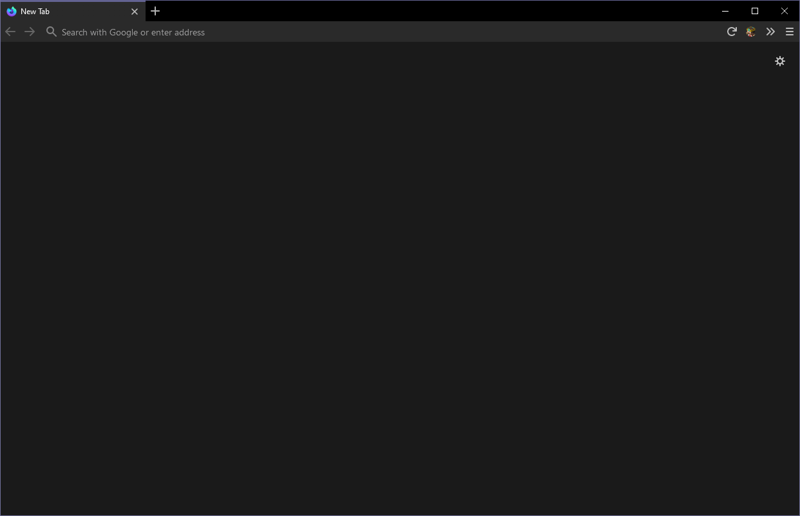
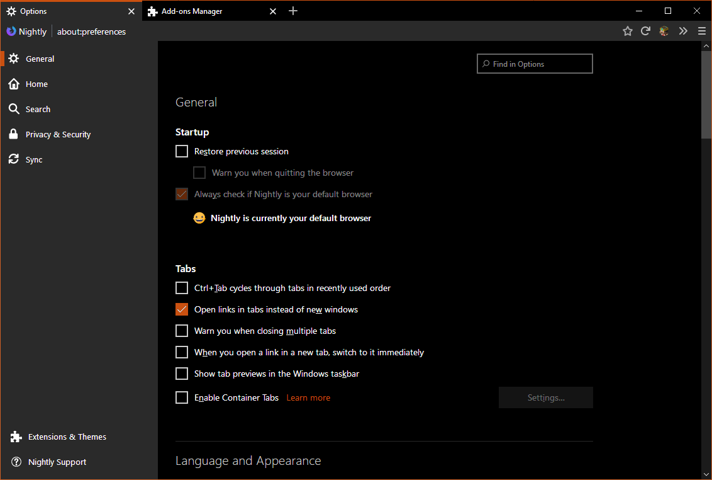
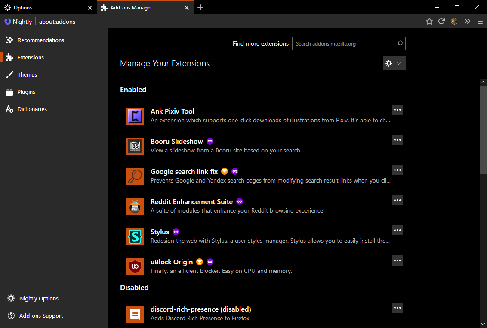
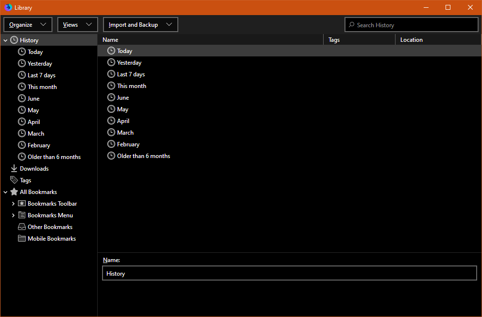
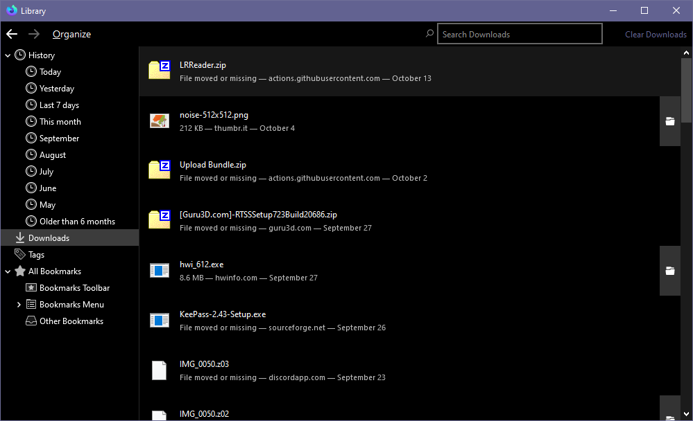
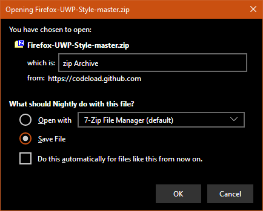
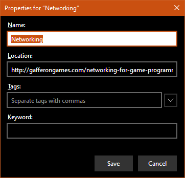
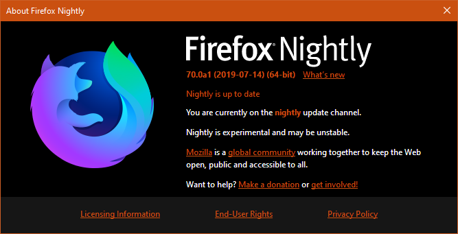

# Firefox UWP Style

This is a very visually simple theme that follows MDL2 styling with the accent color and gray-on-black elements, combines both while remaining original.

## Install

The theme uses OS-level dark/light setting to apply the correct colors. This can cause color issue if you select a theme inside Firefox, to avoid it use the default theme.

Firefox's density modes are supported but only the compact one has been thoroughly tested, if you see any issues please report them here.

From Firefox 69 onwards, new users will have to toggle the `toolkit.legacyUserProfileCustomizations.stylesheets` pref in `about:config` to enable both userChrome.css and userContent.css, users that already had a css file will have it enabled by default.

Select the branch that targets your version of Firefox.

- master > Nightly
- firefox-70 > Firefox 70 & 71.
- firefox-68 > Firefox 68, 69.
- firefox-65 > Firefox 65, 66 & 67.
- firefox-61 > Firefox 61, 62, 63 & 64.
- firefox-58 > Firefox 58, 59 & 60.

### With Git

Go into your Firefox profile folder and clone the repo:
`git clone -b <branch> https://github.com/Guerra24/Firefox-UWP-Style.git chrome`

Replace `<branch>` with the one that targets your version of Firefox.

Now restart Firefox and the theme will be enabled.

Remember to check for newer branch as the supported one can change when firefox update.

### Without Git

Download the code of the branch as ZIP, copy the content inside the folder(where the userChrome.css file is located) into your chrome folder.

Now restart Firefox and the theme will be enabled.

## Acknowledges

Scrollbar JS loading code by [Aris-t2](https://github.com/Aris-t2) (https://github.com/Aris-t2/Scrollbars)

## Screenshots

